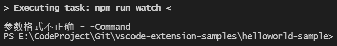

- vscode-path: 介绍文件的路径映射问题，分为launch.json和 Code Runner插件的路径
- vscode-launch：介绍怎么编写luanch.json

---

**Workspace settings** will override **User settings** and are useful for sharing project specific settings across a team.

---

# 问题
## 参数格式不正确 - -Command

也没报错，但在vscode底下任务栏一直正在生成。把出问题的报错命令复制下来输入终端，又能正常运行。

结果这是因为用户配置的`settings.json`中解决windows控制台中文乱码问题而强制设定为UTF-8的原因。把这两句话都删了就没问题。
```json
// 解决终端中文乱码
"terminal.integrated.shellArgs.windows": ["-NoExit", "/c", "chcp 65001"],
"terminal.integrated.fontFamily": "Lucida Console",
```
，一直在那里生成任务。结果这是因为用户配置的`settings.json`中解决windows控制台中文乱码问题而强制设定为UTF-8的原因。把这两句话都删了就没问题。
```json
// 解决终端中文乱码
"terminal.integrated.shellArgs.windows": ["-NoExit", "/c", "chcp 65001"],
"terminal.integrated.fontFamily": "Lucida Console",
```
