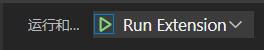

`.vscode`：

# launch.json
```json
{
    "version": "0.2.0",
    "configurations": [
        {
            "type": "node",
            "request": "launch",
            "name": "Launch Program",
            "program": "${workspaceFolder}/node_modules/gulp/bin/gulpfile.js",
            "args": [
                "myFolder/path/app.js"
            ],
            "windows": {
                "args": [
                    "myFolder\\path\\app.js"
                ]
            }
        }
    ]
}
```
mandatory：
- `name` - the reader-friendly name to appear in the Debug launch configuration dropdown.


- `type` - the type of debugger to use for this launch configuration. Every installed debug extension introduces a type: 编译语言的`node`,`python`,`cppdpg`;开发插件的`extensionHost`

- `request` - the request type of this launch configuration. Currently, `launch`and `attach` are supported.

optional：

- `preLaunchTask` - to launch a task before the start of a debug session, set this attribute to the label of a task specified in `tasks.json` (in the workspace's `.vscode` folder). 这种方式一般用于使用现成的外部编辑器编辑好程序再和vscode的debugger连接起来，比如g++, make, npm的eslint。
- `postDebugTask` - to launch a task at the very end of a debug session, set this attribute to the name of a task specified in tasks.json (in the workspace's `.vscode` folder).
- `internalConsoleOptions` - this attribute controls the visibility of the Debug Console panel during a debugging session.
- `debugServer` - for debug extension authors only: this attribute allows you to connect to a specified port instead of launching the debug adapter.
- `serverReadyAction` - if you want to open a URL in a web browser whenever the program under debugging outputs a specific message to the debug console or integrated terminal. For details see section Automatically open a URI when debugging a server program below.
- `presentation` - using the `order`, `group`, and `hidden` attributes , you can sort, group, and hide configurations and compounds in the Debug configuration dropdown and in the Debug quick pick.

- `program` - executable or file to run when launching the debugger.
- `args` - arguments passed to the program to debug
- `env` - environment variables (the value null can be used to "undefine" a variable)
- `envFile` - path to dotenv file with environment variables
- `cwd` - current working directory for finding dependencies and other files
- `port` - port when attaching to a running process
- `stopOnEntry` - break immediately when the program launches
- `console` - what kind of console to use, for example, `internalConsole`, `integratedTerminal`, or `externalTerminal`
- `"windows"` for Windows, `"linux"` for Linux, and `"osx"` for macOS. Properties defined in an operating system specific scope override properties defined in the global scope.

# tasks.json

```json
{
    "version": "2.0.0",
    "tasks": [
        {
            "type": "typescript",
            "tsconfig": "tsconfig.json",
            "problemMatcher": [
                "$tsc"
            ],
            "group": "build",
            "label": "tsc: 构建 - tsconfig.json"
        }
    ]
}
```

The task's properties have the following semantic:

- `label`: The task's label used in the user interface.tasks在Ctrl+Shift+B中显示的名称
- `type`: The task's type. For a custom task, this can either be `shell` or process. If shell is specified, the command is interpreted as a shell command (for example: `bash`, `cmd`, or `PowerShell`). If process is specified, the command is interpreted as a process to execute(for example: `typerscript`).
- `command`: The actual command to execute.
- `group`: Defines to which group the task belongs, `test`,`build`. Tasks that belong to the test group can be executed by running Run Test Task from the Command Palette.
- `presentation`: Defines how the task output is handled in the user interface, `always`, `never`.
- `options`: Override the defaults for `cwd` (current working directory), `env` (environment variables), or `shell` (default shell). Options can be set per task but also globally or per platform. Environment variables configured here can only be referenced from within your task script or process and will not be resolved if they are part of your args, command, or other task attributes.
- `runOptions`: Defines when and how a task is run.
- `windows`: Any Windows specific properties. Will be used instead of the default properties when the command is executed on the Windows operating system.