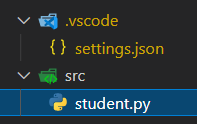

# 文件路径映射

`student.py`文件的路径是`e:\CodeProject\Git\vscode-path\src\student.py`。

## launch.json的映射

修改`launch.json`的`"program": "${file}",`

1. - `${workspaceFolder}`: 工作区`.vscode`的父目录的绝对路径。`E:\CodeProject\Git\vscode-path`
    - `${workspaceRoot}`: 同`${workspaceFolder}`。
2. - `${fileDirname}`: 要运行的文件的父目录的绝对路径。`e:\CodeProject\Git\vscode-path\src` 
3. - `${file}`: 当前文件的绝对路径。`e:\CodeProject\Git\vscode-path\src\student.py`
    - `${relativeFile}`: 当前文件对于工作区间父目录的相对路径。`src\student.py`
    - `${fileBasename}`: 只是文件的名字，带后缀。不带后缀。`student.py`
    - `${fileBasenameNoExtension}`: 不带后缀。`student`

## CodeRunner的映射

修改`settings.json`的`"python":"python -u $fullFileName"`

1. - `$workspaceRoot`：工作区`.vscode`的父目录的绝对路径。`e:\CodeProject\Git\vscode-path`
2. - `$dir`：要运行的文件的父目录的绝对路径，末尾带`\`。`e:\CodeProject\Git\vscode-path\src\`
    - `$dirWithoutTrailingSlash`：末尾不带`\`。`e:\CodeProject\Git\vscode-path\src`

3. - `$fileName`：只是文件的名字，带后缀。`student.py`
    - `$fileNameWithoutExt`：不带后缀。`student`
    - `$fullFileName`：当前文件的绝对路径。。`e:\CodeProject\Git\vscode-path\src\student.py`
